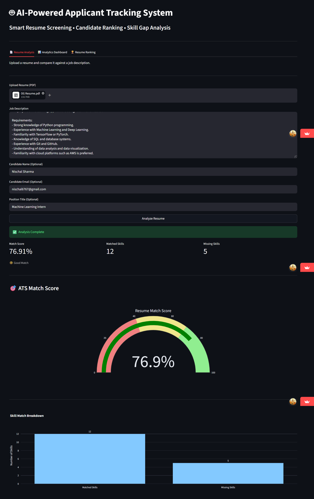
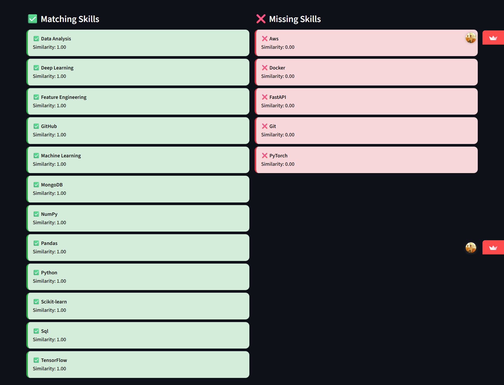
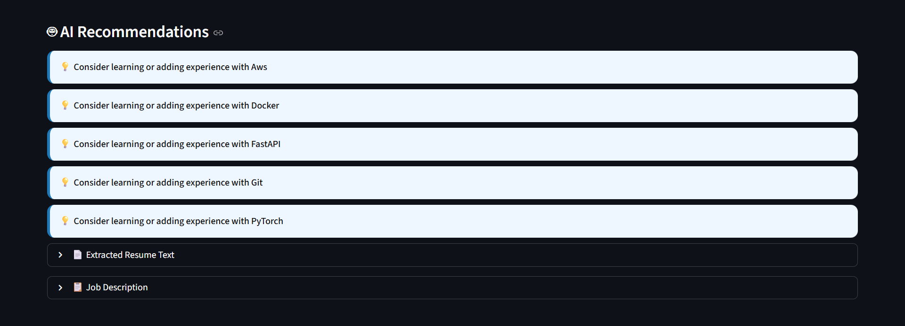
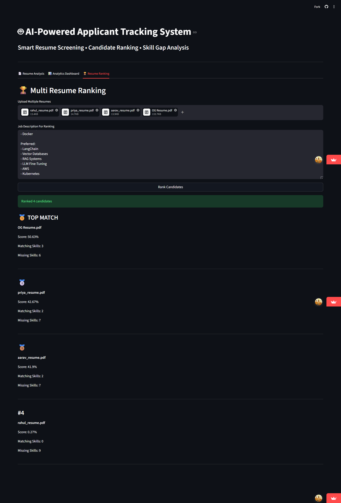
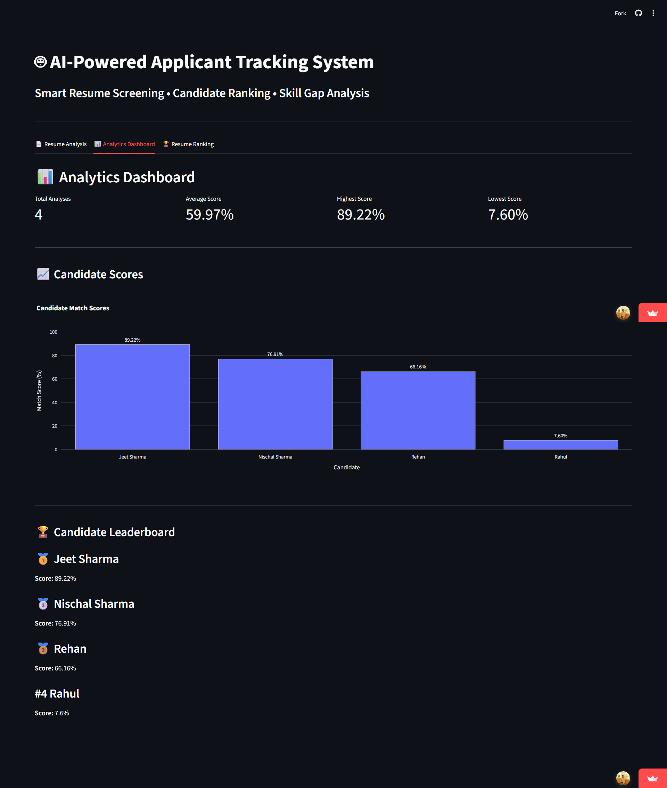

# Resume Screening AI - Applicant Tracking System (ATS)

## Overview

Resume Screening AI is a full-stack Applicant Tracking System (ATS) that analyzes resumes against job descriptions, generates ATS match scores, identifies skill gaps, ranks candidates, and provides personalized skill recommendations.

The platform helps recruiters evaluate candidates efficiently while helping applicants understand how to improve their resumes for specific roles.

---

## Features

- Resume Parsing & Information Extraction
- ATS Match Score Generation
- TF-IDF + Cosine Similarity Based Matching
- Matching Skills Detection
- Missing Skills Analysis
- Personalized Skill Recommendations
- Multi-Resume Candidate Ranking
- Recruiter Analytics Dashboard
- MongoDB Atlas Integration
- Cloud Deployment

---

## Project Highlights

- Developed and deployed a full-stack ATS platform
- Implemented TF-IDF and Cosine Similarity based resume-job matching
- Built candidate ranking and recruiter analytics modules
- Integrated MongoDB Atlas for persistent cloud storage
- Deployed frontend and backend on cloud platforms
- Designed and completed the project during a focused 4-day development sprint

---

## Tech Stack

### Frontend
- Streamlit

### Backend
- FastAPI

### Database
- MongoDB Atlas

### Machine Learning / NLP
- Scikit-Learn
- TF-IDF Vectorization
- Cosine Similarity

### Deployment
- Streamlit Community Cloud
- Render

### Other Tools
- Git
- GitHub
- Pandas

---

## Architecture

```text
User
 ↓
Streamlit Frontend
 ↓
FastAPI Backend
 ↓
TF-IDF + Cosine Similarity Engine
 ↓
MongoDB Atlas
```

---

## Screenshots

### ATS Match Score


### Skill Analysis


### Recommendations


### Candidate Ranking


### Analytics Dashboard


---

## Live Demo

🔗 https://resume-screening-ai1409.streamlit.app/

---

## Installation

```bash
git clone https://github.com/Ni7chal14/resume-screening-ai.git

cd resume-screening-ai

pip install -r requirements.txt

uvicorn backend.main:app --reload
```

---

## Future Improvements

- Interview Question Generation
- Authentication System
- Recruiter Portal
- Advanced NLP Models